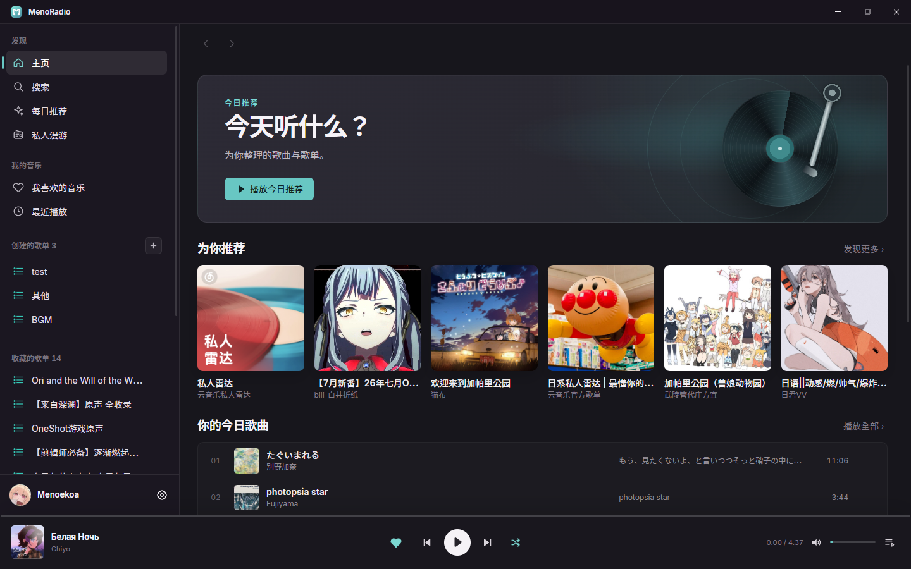
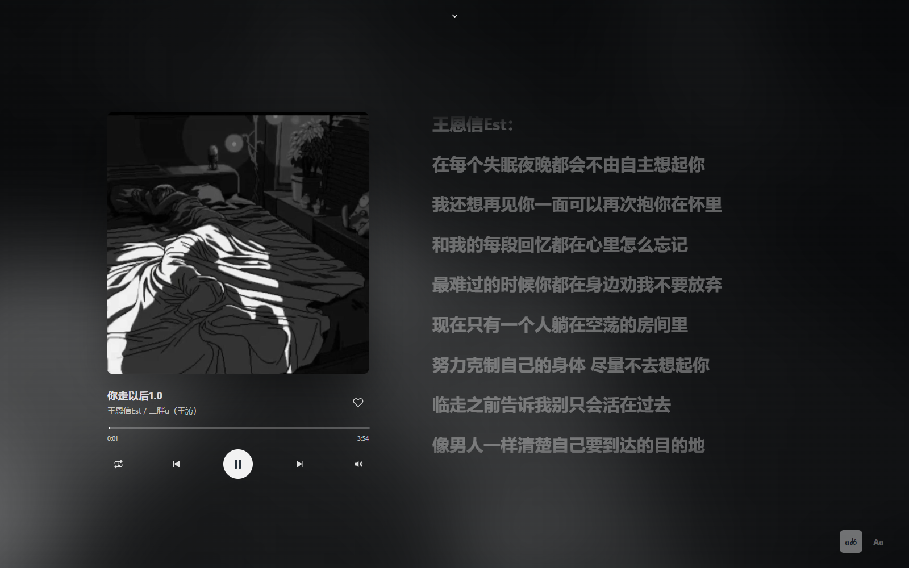

# MenoRadio

MenoRadio 是一款面向 Windows 的非官方网易云音乐桌面播放器。它借鉴了
LyricEase 的信息密度、Fluent 导航和沉浸歌词体验，但使用独立设计与全新的
Electron 实现。



## 现在可以做什么

- 支持网易云二维码、手机号/邮箱密码与 Cookie 三种登录方式
- Cookie 导入作为登录风控时的备用方案，至少支持 `MUSIC_U`
- Windows 安全存储加密保存登录会话
- 浏览热门推荐、每日推荐、用户歌单与歌单详情
- 搜索单曲并在线播放
- 底部常驻播放条、播放队列、单曲循环/列表循环/随机播放、音量与进度控制
- 响应式沉浸播放页、暂停封面缩放、封面高斯模糊背景与歌词翻译
- 自适应及 60%–150% 歌词字号、界面字体切换
- 带分行延迟的队列式歌词滚动，当前歌词固定在视口上部
- 播放页内音量滑杆、百分比和同步静音图标
- Chromium Media Session，对 Windows 媒体快捷键提供基础支持
- 网络请求失败时提供明确的失败状态与重试入口，恢复联网后自动重新加载当前内容



## 直接使用

构建产物位于 `release`：

- `MenoRadio-Setup-<版本>-x64.exe`：可选择安装目录的安装版；安装器不会允许直接安装到磁盘根目录，请选择或新建如 `D:\MenoRadio` 的专用目录
- `MenoRadio-Portable-<版本>-x64.exe`：无需安装的便携版
- `win-unpacked/MenoRadio.exe`：未压缩的开发验收版本

当前构建没有购买商业代码签名证书，因此 Windows SmartScreen 可能显示未知发布者。
请仅使用自己构建或从可信来源取得的二进制文件。

## 登录

点击左下角“登录网易云音乐”，可选择扫码、账号或 Cookie 登录。账号密码只用于
当次网易云登录请求，不会保存在本机；成功后的会话 Cookie 由 Windows 安全存储保护。
受网易云风控影响，账号密码登录并不保证每次可用，遇到验证时请优先使用扫码。

如果网易云风控拒绝扫码，可切换到“Cookie 导入”。从已登录的
`https://music.163.com` 浏览器会话复制 Cookie，粘贴后由应用直接验证。
Cookie 只保存在本机，不会发送给 MenoRadio 开发者。

## 从源码运行

要求：Windows 10/11、Node.js 22 或更新版本。

```powershell
npm install
npm start
```

常用命令：

```powershell
npm run check             # JavaScript 静态语法检查
npm run screenshot        # 启动后截取首页
npm run screenshot:login  # 验证二维码弹窗
npm run screenshot:player # 验证真实播放与歌词页
npm run screenshot:player:wide    # 1600×1000 响应式快照
npm run screenshot:player:compact # 980×700 响应式快照
npm run pack              # 生成 win-unpacked
npm run dist              # 生成安装版与便携版
```

## 项目结构

```text
electron/
  main.cjs       主进程、API 调用、加密会话和窗口管理
  preload.cjs    最小化的安全 IPC 桥
src/
  index.html     应用结构与 SVG 图标系统
  styles.css     Fluent 风格、响应式布局与沉浸歌词视觉
  app.js         路由、播放器、队列、歌词同步和登录状态
  assets/        MenoRadio 自有矢量资源
```

渲染进程启用了 `contextIsolation` 与 sandbox，不能直接访问 Node.js；所有网易云
请求都通过白名单 IPC 进入主进程。会话文件使用 Electron `safeStorage`，在 Windows
上由系统凭据保护。

## 当前边界

- 私人漫游和音乐云盘目前保留了页面入口，数据浏览将在后续版本接入。
- 喜欢歌曲已接入同步请求；新建/编辑歌单、评论和下载尚未实现。
- 音质和可播放性服从账号权益、地区和版权状态；MenoRadio 不绕过 DRM、付费权益或版权限制。
- 网易云接口不是公开稳定 API。上游协议变化可能导致部分功能暂时失效，需要更新
  `@neteasecloudmusicapienhanced/api` 或对应调用逻辑。
- 当前只构建并验证了 Windows x64。

## 说明

MenoRadio 与网易云音乐、LyricEase 均无隶属或授权关系。服务名称、在线音乐、封面与
歌词等数据归各自权利人所有。项目仅供学习和个人使用，请遵守服务条款与当地法律。

API 通信基于 MIT 许可的
[NeteaseCloudMusicApiEnhanced/api-enhanced](https://github.com/NeteaseCloudMusicApiEnhanced/api-enhanced)，
具体归属见 [THIRD_PARTY_NOTICES.md](./THIRD_PARTY_NOTICES.md)。
